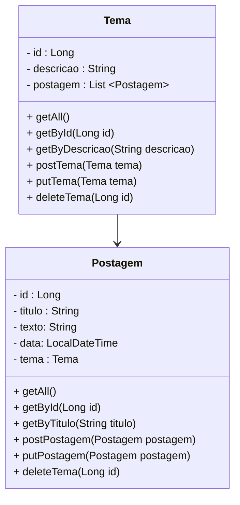
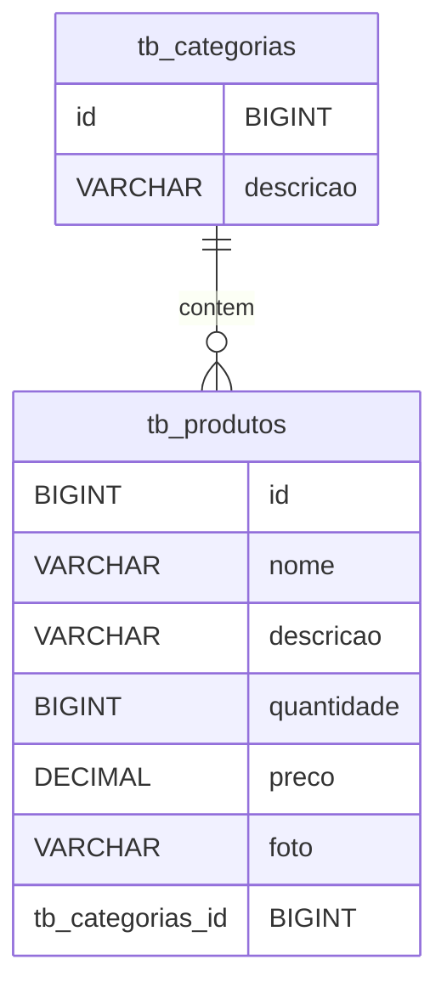

<div align="center">
	


# FoodMinder
**Receitas preparadas com os ingredientes presentes<br>Esta em desenvolvimento!**

[Porque usar](#porque-usar) -
[Como usar](#como-usar) -
[Quando usar](#quando-usar) -
[Aonde usar](#aonde-usar) -
[Diagramas](#diagramas)
<!-- [Diagramas](#diagramas) - -->
<!-- [Alternativas](#alternativas) -->
<br>
<br>
</div>

## Pré-visualização
Em breve.

## Porque usar
- Focado em auxiliar no controle mais amigável do estoque de comida, e a possibilidade de integração com outras ferramentas!

## Como usar
1. Clone o repositório
    - ```git clone https://github.com/renatonunes74/foodminder```
1. Rode localmente
    - CLI / via Terminal:
        - `mvn spring-boot:run`
    - Via IDE (JetBrains, Eclipse...)

### Funcionalidades
- Adicionar, deletar, atualizar novos ingredientes
    - Preview em breve...
- Adicionar, deletar, atualizar receitas personalizadas
    - Preview em breve...
- Ver quais receitas podem ser feitas
    - Preview em breve...

### Tecnologias usadas
- Linguagem: [Java](https://dev.java/)
    - Frameworks: [Spring Boot](https://spring.io/projects/spring-boot)
    - Bibliotecas: ...
- Banco de dados: [MySQL](https://www.mysql.com/)
- Arquitetura: MVC
- Complementares: [Spring Initializer CLI](https://github.com/renatonunes74/spring_initializr_cli)

## Quando usar
- Simples, quando tiver feito uma compra no mercado, liste os itens comprados, além de gerar uma ideia dos custos, também fará uma maior gestão daquilo que consome!
## Aonde usar
- A aplicação esta em desenvolvimento e por enquanto será possível por meio de requisições HTTP...

## Diagramas
### Diagrama de classes

# Diagrama de relacionamento


<!-- ## Alternativas -->
<!-- - [FoodMinder CLI]() -->

## Contribuição
Estou aberto a contribuições, feedback e opiniões da comunidade! Se você tiver alguma ideia para melhorar o projeto, correções de bugs ou sugestões de novos recursos, ficarei feliz em receber sua contribuição! Basta enviar um Pull Request no repositório do projeto.
