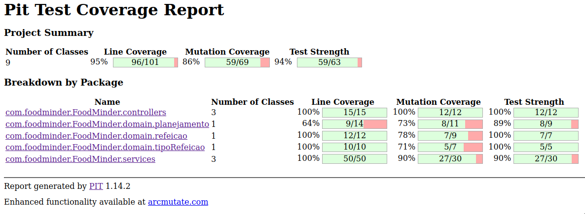

<div align="center">
	


# FoodMinder
**Receitas preparadas com os ingredientes presentes<br>Esta em desenvolvimento!**

[Porque usar](#porque-usar) -
[Como usar](#como-usar) -
[Quando usar](#quando-usar) -
[Aonde usar](#aonde-usar) -
[Testes](#testes) -
[Diagramas](#diagramas)
<br>
</div>

## Pré-visualização


## Porque usar
- Focado em auxiliar no controle mais amigável do estoque de comida, e a possibilidade de integração com outras ferramentas!

## Como usar
1. Clone o repositório
    - `git clone https://github.com/renatonunes74/foodminder`
1. Entre na pasta
    - `cd foodminder/FoodMinder`
1. Rode localmente
    - CLI / via Terminal:
        - `mvn spring-boot:run`
    - Via IDE (JetBrains, Eclipse...)
1. Agora é só fazer as requisições para a API

### Funcionalidades
- Listar (GET)
	- **Planejamentos**
		- [x] Todos
			- `http://localhost:8080/planejamento`
		- [x] Por ID
			- `http://localhost:8080/planejamento/{id}`
				- exemplo:
					- `http://localhost:8080/planejamento/1`
	-  **Refeições**
		- [x] Todas
			- `http://localhost:8080/refeicao`
		- [x] Por ID
			- `http://localhost:8080/refeicao/{id}`
				- exemplo:
					- `http://localhost:8080/refeicao/1`
	-  **Tipos de refeições**
		- [x] Todos
			- `http://localhost:8080/tipoRefeicao`
		- [x] Por ID
			- `http://localhost:8080/tipoRefeicao/{id}`
				- exemplo:
					- `http://localhost:8080/tipoRefeicao/1`
- Adicionar (POST)
	- [x] Novo **planejamento**
		- `http://localhost:8080/planejamento`
			- ```json
				 {
				  "data": "2023-08-12",
				  "tipoRefeicao": {
					"id": 1
				  },
				  "refeicao": {
					"id": 1
				  }
				}
				```
	- [x] Nova **refeição**
		- `http://localhost:8080/refeicao`
			- ```json
				{
					"nome": "Lasanha"
					"receita": "receita.md"
				}
				```
	- [x] Novo **tipo de refeição**
		- `http://localhost:8080/tipoRefeicao`
			- ```json
				{
					"tipo": "Café da Tarde"
				}
				```
- Atualizar (PUT)
	- [ ] **Planejamento** por ID
	- [ ] **Refeição** por ID
	- [ ] **Tipo de refeição** por ID
- Deletar (DELETE)
	- [x] **Planejamento** por ID
		- `http://localhost:8080/planejamento/{id}`
			- exemplo
				- `http://localhost:8080/planejamento/1`
	- [x] **Refeição** por ID
		- `http://localhost:8080/refeicao/{id}`
			- exemplo
				- `http://localhost:8080/refeicao/1`
	- [x] **Tipo de refeição** por ID
		- `http://localhost:8080/tipoRefeicao/{id}`
			- exemplo
				- `http://localhost:8080/tipoRefeicao/1`

### Dependências necessárias
- [Java](https://dev.java/)
- [MySQL](https://www.mysql.com/)

### Tecnologias usadas
- Linguagem: [Java](https://dev.java/)
    - Frameworks: [Spring Boot](https://spring.io/projects/spring-boot)
    - Bibliotecas:
        - [Lombok](https://projectlombok.org/) (Anotações para gerar automaticamente métodos getters, setters, construtores, entre outros, em tempo de compilação)
        - [FlyWay](https://documentation.red-gate.com/fd/flyway-documentation-138346877.html) (Versionamento do banco de dados)
        - [Pitest](https://pitest.org/) (Testes de mutação)
- Banco de dados: [MySQL](https://www.mysql.com/)
- Complementares:
     - [Mermagic](https://github.com/renatonunes74/mermagic) (Criação automática de diagrama de classes Java usando [Mermaid](https://mermaid.js.org))
     - [Mermerd](https://github.com/KarnerTh/mermerd) (Criação automática de diagrama de relacionamento)
     - [Spring Initializer CLI](https://github.com/renatonunes74/spring_initializr_cli) (Para a criação do Spring Boot)
     - [VHS](https://github.com/charmbracelet/vhs) (Criação de GIF do terminal via código)
     - [httpie](https://httpie.io/) (Maior facilidade para requisições HTTP (alternativa ao `curl`))

## Quando usar
- Simples, quando tiver feito uma compra no mercado, liste os itens comprados, além de gerar uma ideia dos custos, também fará uma maior gestão daquilo que consome!
## Aonde usar
- A aplicação esta em desenvolvimento e por enquanto será possível por meio de requisições HTTP...

## Testes
### Testes por mutação e cobertura
- **06-08-2023**
	- 

## Diagramas
<!-- ### Diagrama de classes -->
<!-- ```mermaid -->
<!-- ``` -->

### Diagrama de relacionamento


## Alternativas
- [MealCLI](https://github.com/renatonunes74/meal)
	- Gerenciador de refeições CLI usando SHELL

## Contribuição
Estou aberto a contribuições, feedback e opiniões da comunidade! Se você tiver alguma ideia para melhorar o projeto, correções de bugs ou sugestões de novos recursos, ficarei feliz em receber sua contribuição! Basta enviar um Pull Request no repositório do projeto.
